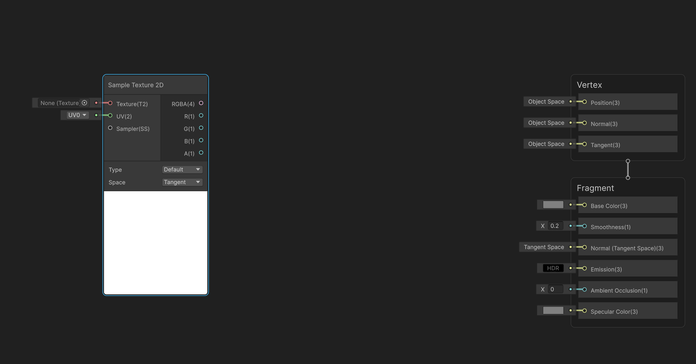
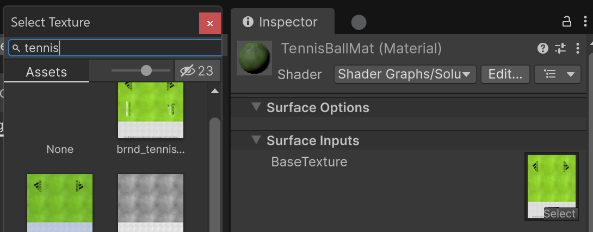
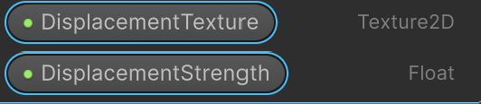
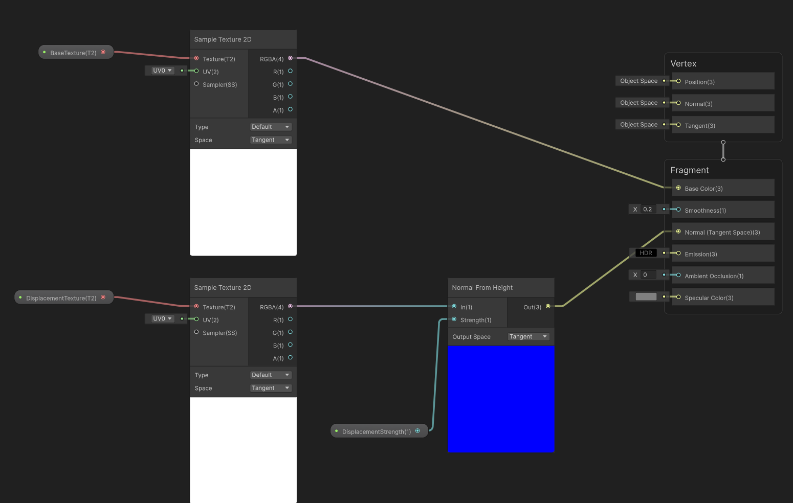
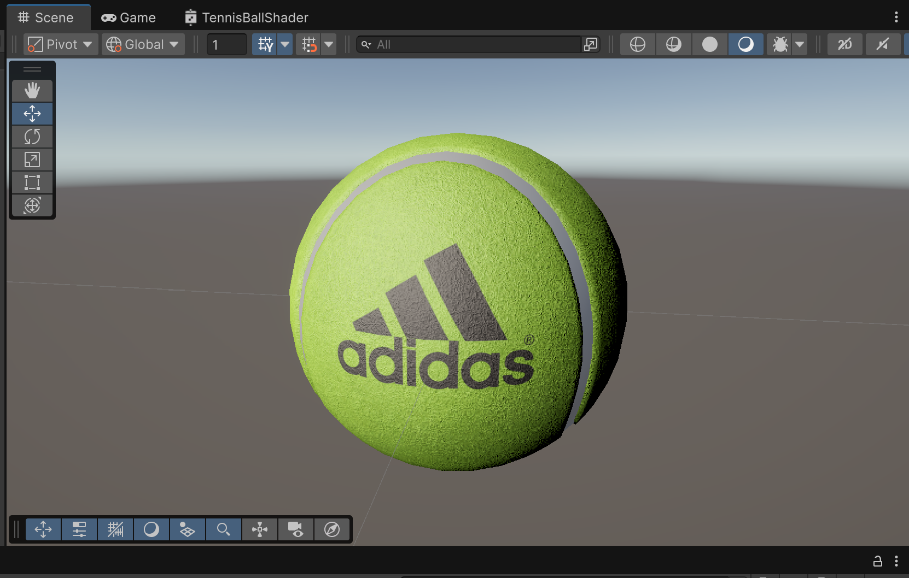
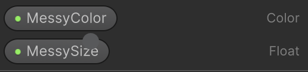
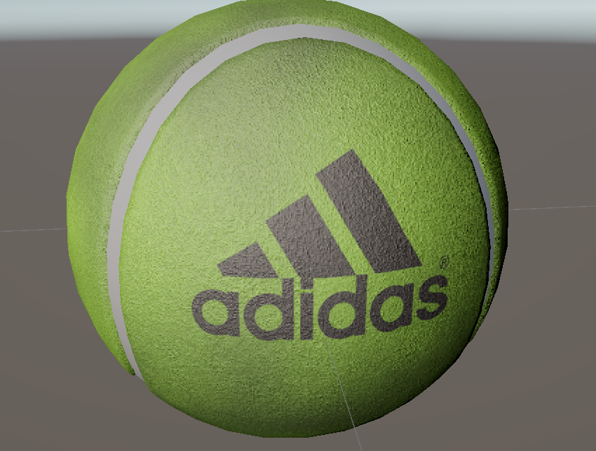

# Shader Graph Tutorial

Hello there fellow student.
In this tutorial I will teach you how you can use shader graph to create a recognizable tennis ball. For this you will need to be in the scene called "Tutorial Scene". Once you have achieved this great victory you will start making your first shader graph. Before we do that note that there are 3 folders in this "Tutorial - Shader Graph" map.

Folders:
* Ignore, DONT TOUCH IT OR THINGS GO PINK.
* ReadmeImages, not important.
* Solution, if you want to be lame or don't know the solution. Or you want to compare with your own solution.
* tennis_balls_FBX, you will use the texture in this folder later.

## Step 1: Create Shader and Material
Make a **Lit Shader Graph** like in the screen below.

Once you've create a shader graph and gave it a cool name create a new material. I named my TennisBallMat and TennisBallShader.

## Step 2: Make material of the Shader type
This one is tricky. You want to hold the shader and drag it to the material icon. You got this!
Once you've done this, the material will use the shader. Then drag this material to the prefab tennis ball that is in the scene. The shader is empty so far but we're gonna do something about that.

## Step 3: Opening Shader Graph
Double click the shader you created. You will see the shader graph editor. (Tip: if you click on the shader editor window and press Shift + Space, the window will be fullscreen)

## Step 4: Adding a texture
Shader graph works with nodes. To add a node press space and look for the the "Sample Texture 2D" node.

In the top right is where you can set parameters for the shader. These parameters can be tweaked in the material you made that uses this shader. Create a new parameter by clicking the + icon and select texture 2D. Name it whatever you want, I'm going to call it BaseTexture.

Drag this parameter to near the sample texture 2d node and connect them by dragging the red circle in the node to the "Texture" parameter in the sample texture 2d node. Then drag the output RGBA of the sample texture 2d node to the "Base Color" in "Fragment".

Save the content by pressing ctrl +s and go the your material. You will notice a new parameter has magically appeared with your given name for the texture. In the slot select the tennisball texture.

You will notice that the tennisball prefab has changes to the texture. Good job!

## Step 5: Adding depth
We are now going to add a sort of depth to the tennisball (which will create kind of a gritty ball). We do this by telling unity how light should react on this object. We can do this by using a normal map. First create a new texture 2d parameter like we did for the BaseTexture. I called my parameter "DisplacementTexture". Also create a parameter that is of the type float for the strength of the displacement. I called mine "DisplacementStrength".

Create a new "Sample Texture 2d node and add the "DisplacementTexture" to this. Then drag the RGBA output to an empty space. Here type in "Normal From Height: In". This node also has a strength parameters. Let's use the DisplacementStrength parameter we added earlier for this connect this to the "Normal from Height" node and connect this node to the "Normal" in "Fragment. This is what it would like so far.

Go back to your material and assign the tennisball texture (the gray one) and for strength I use 0.0002 (but you can play with the strength if you want).

Your tennis ball should look something like this (I hope):

Gongratulations! 👏👏👏🎉🎉🎉🎉🎉

You are now a semi proffessional shader graph expert. However we do not accept lame rankings. We want you to become a Shader Graph Ultra expert!

Tennisballs are only this clean when you buy them new. However our tennisball has been played with a couple of times. Therefore it became a bit messy. We want to replicate that on this tennisball!

## Step 5: Making the tennisball messy
Let's start by create 3 new parameters inside the shader graph editor.

Add a "Simple noise texture", and put the MessySize in the Scale of this node. Then add a "multiply" node and connect the "out" of the simple noise node to the multiply node. Also drag the MessyColor to this multiply node (so that we can change the color of the messy texture). After that add a Lerp node (this is to blend the base texture and the messy texture.) and connect the out of the base texture sample texture 2d to the lerp and connect the multiply to the lerp. Then connect the simple noise to the "t".

Finnaly put the "out" of the lerp node into the base color of the "fragment.

Pfew, that was a lot. Here is a reference.

For the parameters in the material I use 26 for the MessySize and the color black for the MessyColor.

Your tennisball should look something like this.

If you need any help you can check the Solution folder for reference.

Great job!
