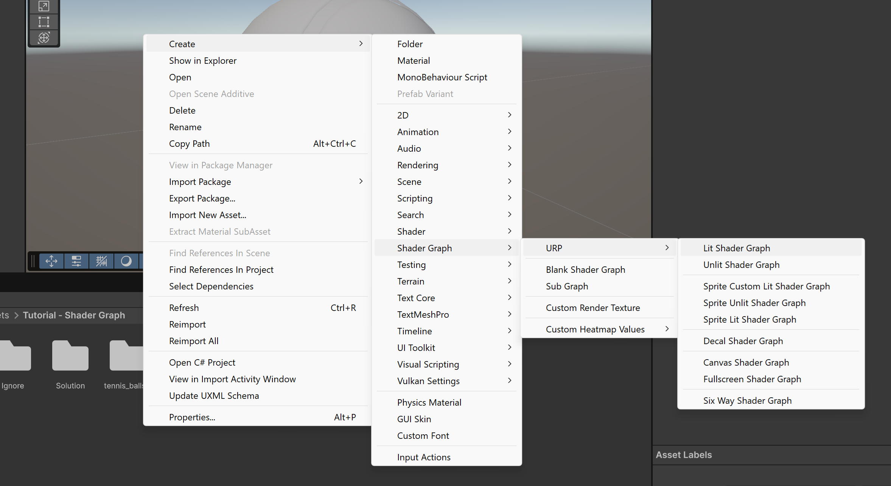

# Shader Graph Tutorial

Hello there fellow student.
In this tutorial I will teach you how you can use shader graph to create a recognizable tennis ball. For this you will need to be in the scene called "Tutorial Scene". Once you have achieved this great victory you will start making your first shader graph. Before we do that note that there are 3 folders in this "Tutorial - Shader Graph" map.

Folders:
* Ignore, DONT TOUCH IT OR THINGS GO PINK.
* ReadmeImages, not important.
* Solution, if you want to be lame or don't know the solution. Or you want to compare with your own solution.
* tennis_balls_FBX, you will use the texture in this folder later.

## Step 1
Make a Lit Shader Graph like in the screen below.

